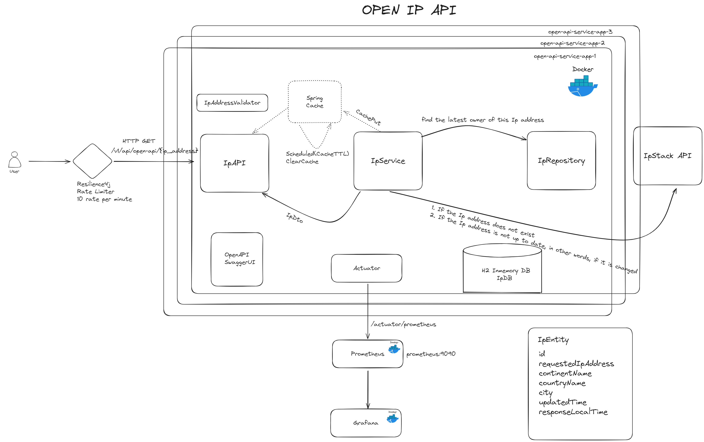

# Open IP API Application

## Overal Architecture



### This service provides an API
#### `IP API`
- To search the continent, country and city information based on a provided ip address
#### How does this application work ?
- Application receives the request via /v1/api/ip/{ip} url with {ip} path variable
- There is a validation for ip parameter. There is a regex for checking whether the provided ip is valid or not.
  -- If the ip value is not valid, the api returns 400 - Http Bad Request response
- Ip related information (continent, country and city) can be fetch either from database or IpStackAPI with the API_KEY
  -- If the latest data is not older than 30 minutes for that ip, data is fetching from db.
  -- Either ip does not exist or older than 30 minutes in DB, a request sends to IpStackAPI and the result puts to Cache.
  -- If there is a value with ip filter as key in cache, the response is returned from cache directly.
  On the swagger page, you can find the relevant api endpoint. You can reach the openapi page by
  `http://localhost:8080/swagger-ui/index.html` url.

You can define **API_KEY** for the IPStackAPI in the `.env` file.

## Technologies
- Java 17
- Spring Boot 3.2
- Open API Documentation
- Spring Data JPA
- H2 In Memory Database
- Restful API
- Maven
- Docker
- Docker Compose
- Prometheus
- Grafana
- Github Actions

## Technologies
- Maven or Docker

## Docker Run
The application can be built and run by the Docker engine. The Dockerfile has multistage build, so you do not need to build and run separately.

Please follow the below directions in order to build and run the application with Docker-Compose;

```sh
$ cd open-api
$ docker-compose up -d
```
Docker compose creates 3 replicas (instances) of the application on port range 9585-9587.


#### You can reach the open-ip-ui via`http://{HOST}:{9585-9587}/swagger-ui.html`

### Prometheus
#### You can reach prometheus page via `http://{HOST}:9090`
### Grafana
#### You can reach grafana page via `http://{HOST}:3000` - GF_SECURITY_ADMIN_PASSWORD=admin

## Maven Run
To build and run the application with Maven, please follow the directions below;
```sh
$ cd open-api
$ mvn clean install
$ mvn spring-boot:run
```
#### You can reach the swagger-ui via `http://{HOST}:8080/swagger-ui.html`